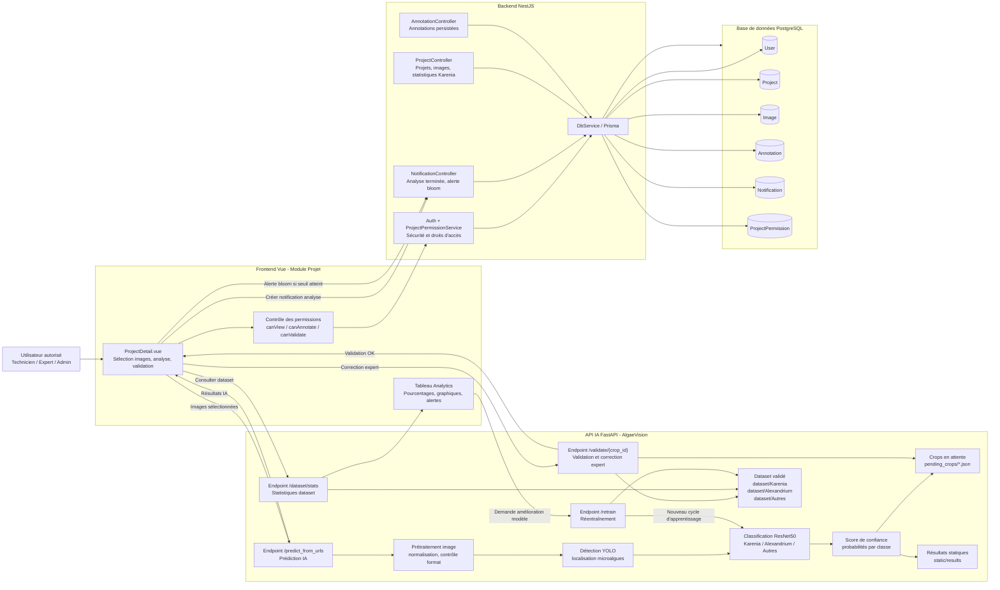
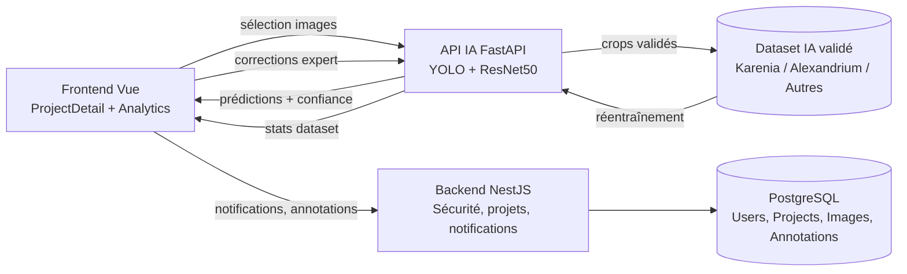
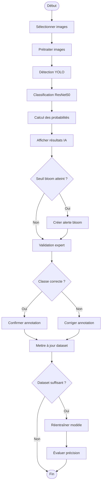

# Diagrammes UML - Partie IA haute performance et haute précision

Ce document présente l'architecture IA de l'application Phyto/BioScan avec un objectif de haute performance, haute précision et réduction maximale des erreurs grâce à la validation experte.

## 1. Diagramme de composants de la partie IA

## 2. Diagramme d'activité de la partie IA

```mermaid
flowchart TD
Start([Début du processus IA])

Start --> Auth{Utilisateur authentifié ?}
Auth -- Non --> Login[Rediriger vers connexion]
Login --> EndDenied([Fin : accès refusé])

Auth -- Oui --> LoadProject[Charger le projet]
LoadProject --> CheckPerm{Droit canAnnotate ?}
CheckPerm -- Non --> Denied[Afficher accès refusé]
Denied --> EndDenied

CheckPerm -- Oui --> SelectImages[Sélectionner les images à analyser]
SelectImages --> ValidateInput{Images valides et disponibles ?}
ValidateInput -- Non --> InputError[Afficher erreur de sélection]
InputError --> SelectImages

ValidateInput -- Oui --> SendAI[Envoyer les images à l'API IA]
SendAI --> Preprocess[Prétraiter les images<br/>format, taille, normalisation]
Preprocess --> Detect[Détecter les microalgues<br/>modèle YOLO]
Detect --> Crop[Extraire les zones détectées]
Crop --> Classify[Classifier chaque crop<br/>ResNet50]
Classify --> Confidence[Calculer les probabilités<br/>Karenia, Alexandrium, Autres]

Confidence --> Quality{Confiance suffisante ?}
Quality -- Non --> FlagReview[Marquer comme à vérifier]
Quality -- Oui --> AcceptPrediction[Préparer prédiction IA]
FlagReview --> MergeResults
AcceptPrediction --> MergeResults[Regrouper résultats par image]

MergeResults --> Display[Afficher résultats, classes et scores]
Display --> ComputeStats[Calculer statistiques<br/>total cellules, % Karenia, % Alexandrium]

ComputeStats --> Bloom{Seuil bloom atteint ?}
Bloom -- Oui --> CreateAlert[Créer alerte bloom<br/>ADMIN / EXPERT]
Bloom -- Non --> WaitValidation[Attendre validation experte]
CreateAlert --> WaitValidation

WaitValidation --> CanValidate{Droit canValidate ?}
CanValidate -- Non --> ReadOnly[Afficher résultats en lecture seule]
ReadOnly --> EndRead([Fin : consultation])

CanValidate -- Oui --> ExpertReview[L'expert vérifie les prédictions]
ExpertReview --> Correction{Classe correcte ?}
Correction -- Oui --> Confirm[Confirmer la classe]
Correction -- Non --> Correct[Corriger la classe]

Confirm --> SaveDataset[Enregistrer crop dans dataset validé]
Correct --> SaveDataset
SaveDataset --> SaveAnnotation[Mettre à jour les annotations]
SaveAnnotation --> NotifyValidation[Créer notification de validation]
NotifyValidation --> RefreshStats[Actualiser analytics et dataset]

RefreshStats --> RetrainDecision{Dataset suffisant pour réentraînement ?}
RetrainDecision -- Non --> End([Fin])
RetrainDecision -- Oui --> AskRetrain{Expert/Admin lance réentraînement ?}
AskRetrain -- Non --> End
AskRetrain -- Oui --> Retrain[Lancer /retrain en tâche de fond]
Retrain --> Evaluate[Évaluer le modèle amélioré]
Evaluate --> Deploy{Performance et précision meilleures ?}
Deploy -- Non --> KeepOld[Conserver modèle précédent]
Deploy -- Oui --> UpdateModel[Mettre à jour le modèle IA]
KeepOld --> End
UpdateModel --> End
```

## 3. Version courte pour le rapport

### Diagramme de composants - résumé

### Diagramme d'activité IA - résumé

## 4. Points de qualité pour haute précision

| Objectif | Mécanisme proposé |
|---|---|
| Haute précision | Classification avec score de confiance et validation experte obligatoire pour les cas sensibles. |
| Zéro faute métier | Toute prédiction douteuse passe par une étape de vérification humaine avant d'alimenter le dataset. |
| Haute performance | Traitement par lot des images sélectionnées, séparation frontend/backend/API IA, et tâche de fond pour le réentraînement. |
| Traçabilité | Chaque crop possède un `crop_id`, une classe prédite, une classe confirmée et un chemin dataset. |
| Amélioration continue | Les corrections expertes enrichissent le dataset, puis déclenchent un réentraînement contrôlé. |
| Alertes fiables | Les alertes bloom sont déclenchées selon un seuil et dédupliquées côté backend. |
