# Analyse UML de l'application Phyto / BioScan

Ce document analyse l'application à partir du code existant : frontend Vue, backend NestJS, base Prisma/PostgreSQL et API IA FastAPI.  
Les diagrammes sont fournis en Mermaid.

## 1. Acteurs

| Acteur | Description |
|---|---|
| Visiteur | Utilisateur non authentifié qui peut consulter la page d'accueil, s'inscrire ou se connecter. |
| Utilisateur | Compte authentifié avec accès aux projets autorisés. |
| Technicien | Utilisateur métier pouvant créer des projets, charger des images et lancer des analyses selon ses droits. |
| Expert | Utilisateur métier pouvant analyser, corriger et valider les annotations IA. |
| Administrateur | Responsable de la gestion des comptes, permissions, projets, modèles IA et configurations. |
| API IA | Service FastAPI simulant la détection/classification des microalgues et le réentraînement. |
| Système de notification | Module backend qui crée, lit et marque les notifications. |

## 2. Diagramme de cas d'utilisation global

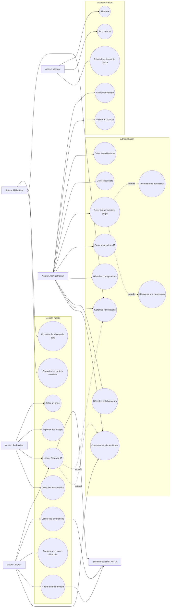

## 3. Diagramme de classes

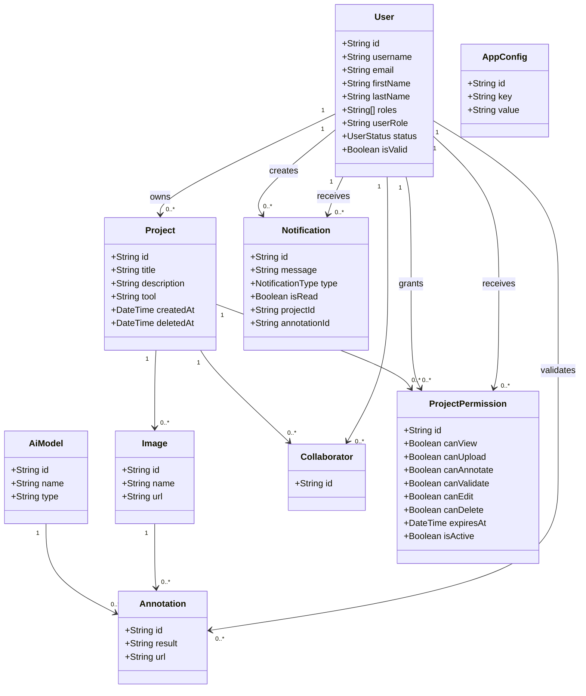

## 4. Diagramme d'activité principal

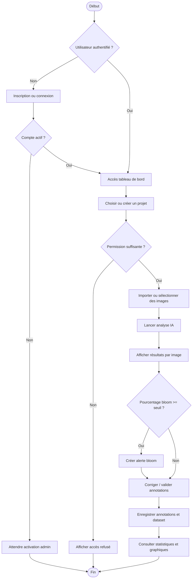

## 5. Diagrammes d'état

### 5.1 État d'un compte utilisateur

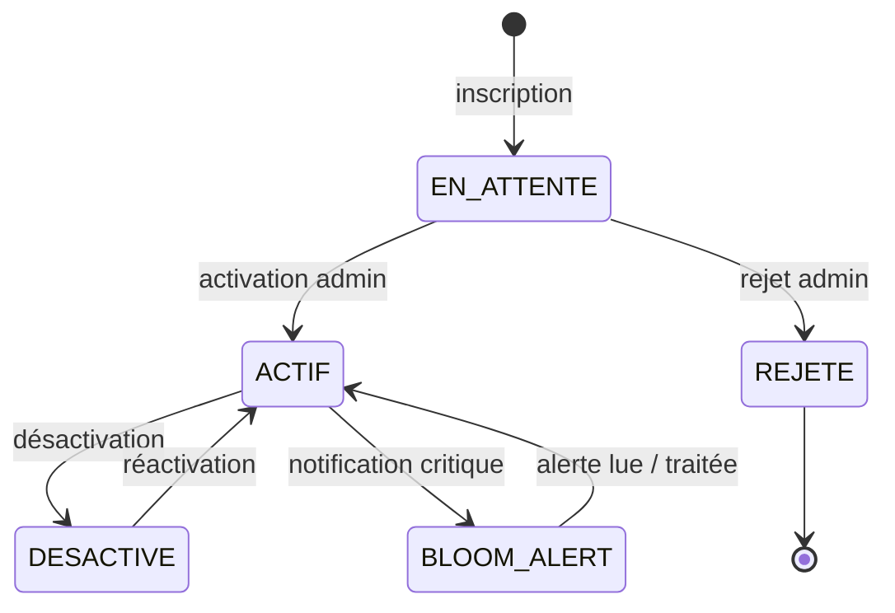

### 5.2 État d'une annotation IA

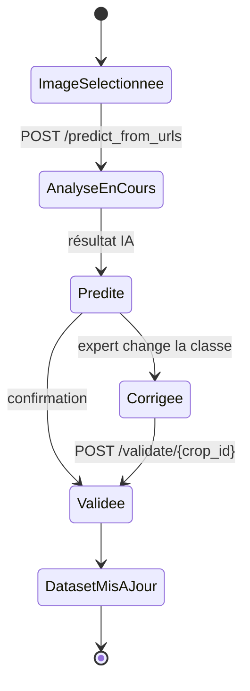

### 5.3 État d'une notification

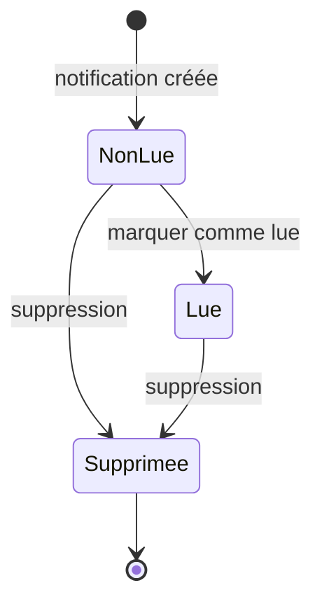

## 6. Cas d'utilisation détaillés avec diagrammes de séquence

### CU01 - S'inscrire

| Champ | Description |
|---|---|
| ID | CU01 |
| Cas d'utilisation | S'inscrire |
| Description | Permet à un visiteur de créer un compte en attente de validation. |
| Acteurs primaires | Visiteur |
| Préconditions | Le visiteur n'a pas encore de session active. |
| Enchaînement principal | 1. Le visiteur remplit le formulaire. 2. Le frontend appelle `POST /sign_up`. 3. Le backend crée l'utilisateur. 4. Le compte reçoit le statut `EN_ATTENTE`. |
| Postconditions | Un compte est créé et attend l'activation administrateur. |

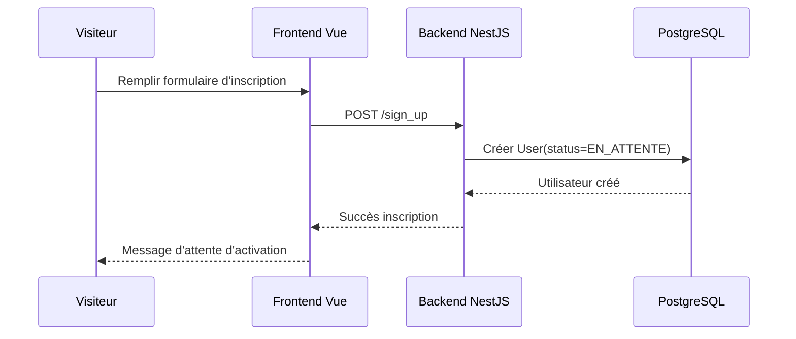

### CU02 - Se connecter

| Champ | Description |
|---|---|
| ID | CU02 |
| Cas d'utilisation | Se connecter |
| Description | Authentifie l'utilisateur et récupère son rôle métier. |
| Acteurs primaires | Utilisateur, Technicien, Expert, Administrateur |
| Préconditions | Le compte existe et les identifiants sont valides. |
| Enchaînement principal | 1. L'utilisateur saisit email/mot de passe. 2. Le frontend appelle Supabase via le service auth. 3. Le rôle est enrichi depuis `GET /users/me`. 4. La session est stockée. |
| Postconditions | L'utilisateur accède au tableau de bord selon son rôle. |

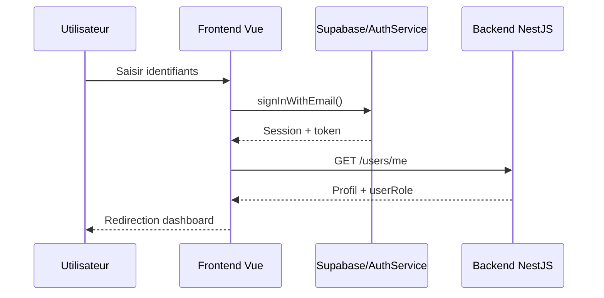

### CU03 - Activer ou rejeter un compte

| Champ | Description |
|---|---|
| ID | CU03 |
| Cas d'utilisation | Activer ou rejeter un compte |
| Description | Permet à l'administrateur de traiter les comptes en attente. |
| Acteurs primaires | Administrateur |
| Préconditions | Administrateur connecté, utilisateur en statut `EN_ATTENTE`. |
| Enchaînement principal | 1. L'admin consulte les comptes en attente. 2. Il clique sur Activer ou Rejeter. 3. Le backend vérifie le rôle admin. 4. Le statut utilisateur est mis à jour. |
| Postconditions | Le compte devient `ACTIF` ou `REJETE`. |

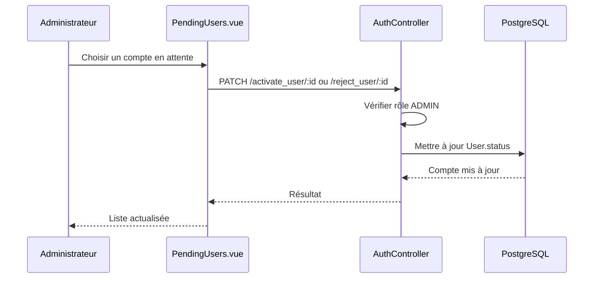

### CU04 - Gérer les utilisateurs

| Champ | Description |
|---|---|
| ID | CU04 |
| Cas d'utilisation | Gérer les utilisateurs |
| Description | Créer, consulter, modifier, supprimer ou importer des utilisateurs. |
| Acteurs primaires | Administrateur |
| Préconditions | Administrateur authentifié. |
| Enchaînement principal | 1. L'admin ouvre la liste. 2. Il choisit une action CRUD/import. 3. Le backend applique l'opération. 4. La liste est rafraîchie. |
| Postconditions | Les données utilisateur sont mises à jour. |

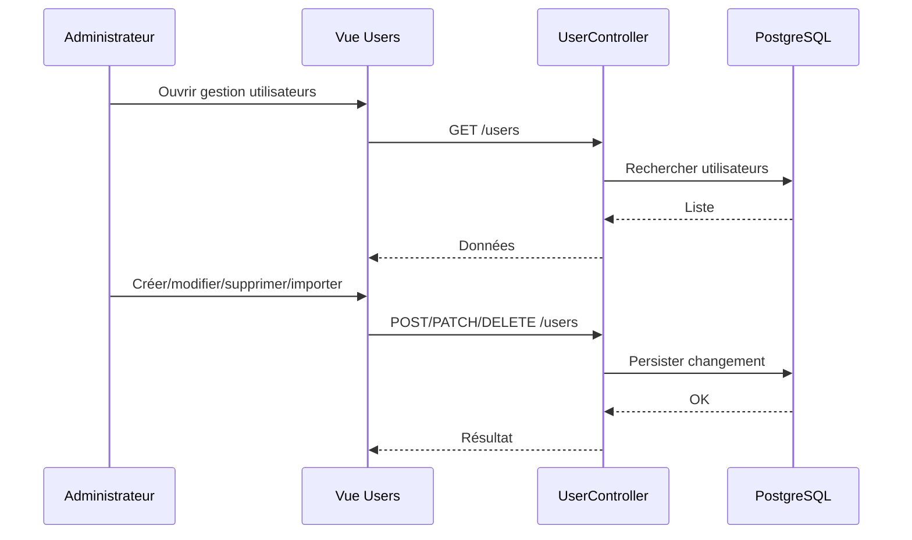

### CU05 - Créer un projet

| Champ | Description |
|---|---|
| ID | CU05 |
| Cas d'utilisation | Créer un projet |
| Description | Crée un projet avec titre, description, outil et images éventuelles. |
| Acteurs primaires | Administrateur, Expert, Technicien |
| Préconditions | Utilisateur authentifié avec droit de création. |
| Enchaînement principal | 1. L'acteur remplit le formulaire projet. 2. Il ajoute éventuellement des images. 3. Le backend crée le projet et ses images. 4. Une notification de nouveau projet peut être créée. |
| Postconditions | Le projet est disponible dans la liste. |

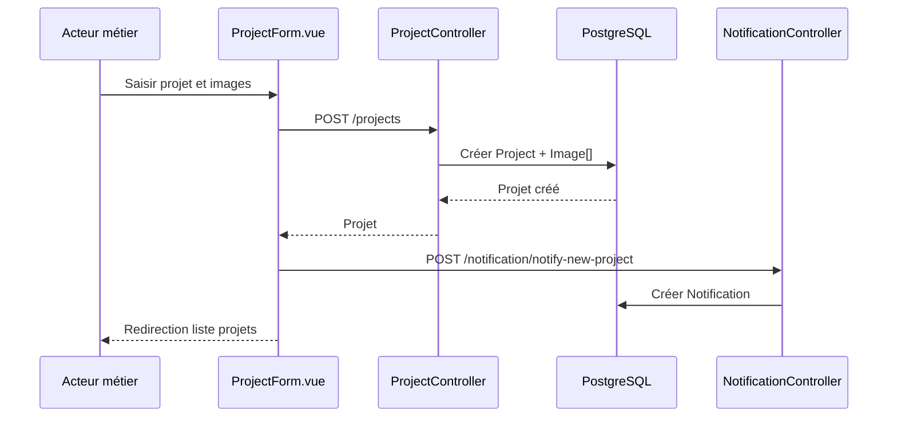

### CU06 - Consulter les projets autorisés

| Champ | Description |
|---|---|
| ID | CU06 |
| Cas d'utilisation | Consulter les projets autorisés |
| Description | Affiche les projets possédés ou partagés avec l'utilisateur. |
| Acteurs primaires | Utilisateur, Technicien, Expert, Administrateur |
| Préconditions | Utilisateur authentifié. |
| Enchaînement principal | 1. L'utilisateur ouvre la liste. 2. Le backend calcule les droits. 3. Les projets accessibles sont renvoyés. |
| Postconditions | L'utilisateur voit uniquement les projets consultables. |

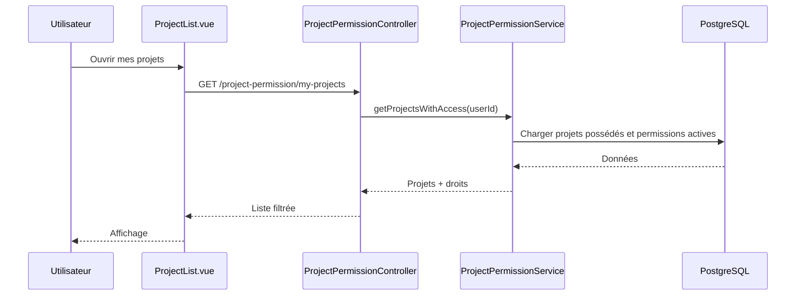

### CU07 - Modifier un projet

| Champ | Description |
|---|---|
| ID | CU07 |
| Cas d'utilisation | Modifier un projet |
| Description | Modifie le titre, la description, l'outil ou le propriétaire d'un projet. |
| Acteurs primaires | Administrateur, propriétaire, utilisateur avec `canEdit` |
| Préconditions | Projet existant, droit de modification. |
| Enchaînement principal | 1. L'acteur ouvre le formulaire d'édition. 2. Il modifie les informations. 3. Le backend vérifie les attributs autorisés. 4. Le projet est mis à jour. |
| Postconditions | Le projet contient les nouvelles informations. |

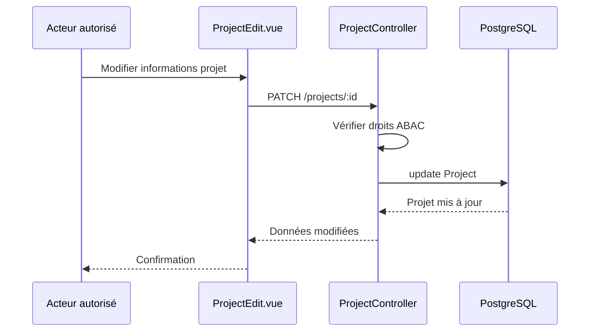

### CU08 - Supprimer un projet

| Champ | Description |
|---|---|
| ID | CU08 |
| Cas d'utilisation | Supprimer un projet |
| Description | Supprime logiquement ou retire un projet de la liste. |
| Acteurs primaires | Administrateur, propriétaire, utilisateur avec `canDelete` |
| Préconditions | Projet existant, droit de suppression. |
| Enchaînement principal | 1. L'acteur clique Supprimer. 2. Le frontend demande confirmation. 3. Le backend supprime le projet. 4. L'utilisateur revient à la liste. |
| Postconditions | Le projet n'est plus affiché dans les projets actifs. |

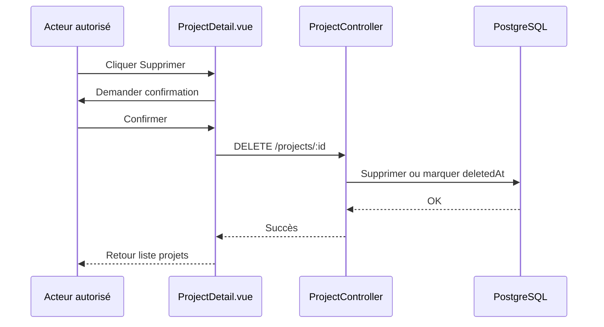

### CU09 - Gérer les permissions d'un projet

| Champ | Description |
|---|---|
| ID | CU09 |
| Cas d'utilisation | Gérer les permissions projet |
| Description | Accorde, modifie ou révoque les droits d'un utilisateur sur un projet. |
| Acteurs primaires | Administrateur |
| Préconditions | Administrateur authentifié, projet et utilisateur existants. |
| Enchaînement principal | 1. L'admin ouvre l'écran permissions. 2. Il sélectionne un utilisateur et les droits. 3. Le backend vérifie que le donneur est admin. 4. Les permissions sont créées ou mises à jour. |
| Postconditions | L'utilisateur ciblé possède les droits accordés ou révoqués. |

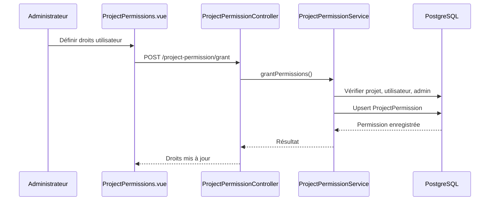

### CU10 - Importer des images

| Champ | Description |
|---|---|
| ID | CU10 |
| Cas d'utilisation | Importer des images |
| Description | Ajoute des images à un projet pour permettre l'analyse IA. |
| Acteurs primaires | Technicien, Expert, Administrateur |
| Préconditions | Projet existant, droit `canUpload`. |
| Enchaînement principal | 1. L'acteur choisit les fichiers. 2. Les images sont associées au projet. 3. Le backend enregistre les métadonnées `Image`. |
| Postconditions | Les images apparaissent dans la galerie du projet. |

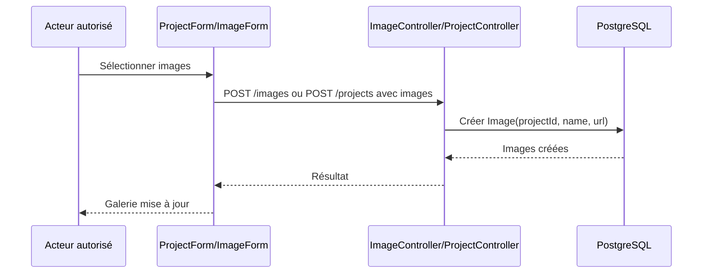

### CU11 - Lancer l'analyse IA

| Champ | Description |
|---|---|
| ID | CU11 |
| Cas d'utilisation | Lancer l'analyse IA |
| Description | Envoie les images sélectionnées à l'API IA pour détecter et classifier les microalgues. |
| Acteurs primaires | Technicien, Expert, Administrateur |
| Préconditions | Images sélectionnées, droit `canAnnotate`. |
| Enchaînement principal | 1. L'acteur sélectionne des images. 2. Il lance l'analyse. 3. Le frontend appelle `POST /predict_from_urls`. 4. L'API IA retourne les crops, classes et probabilités. 5. Les résultats sont affichés. |
| Postconditions | Les prédictions sont visibles et prêtes à validation. |

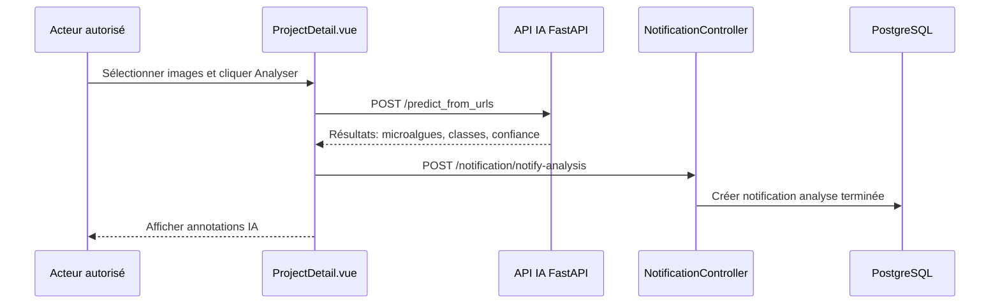

### CU12 - Valider ou corriger les annotations

| Champ | Description |
|---|---|
| ID | CU12 |
| Cas d'utilisation | Valider les annotations |
| Description | Confirme ou corrige les classes proposées par l'IA et enrichit le dataset. |
| Acteurs primaires | Expert, Administrateur |
| Préconditions | Analyse IA réalisée, droit `canValidate`. |
| Enchaînement principal | 1. L'expert modifie éventuellement la classe détectée. 2. Il valide. 3. Le frontend appelle `POST /validate/{crop_id}` pour chaque crop modifié. 4. L'API IA déplace le fichier dans la bonne classe du dataset. |
| Postconditions | Les annotations sont validées et le dataset est mis à jour. |

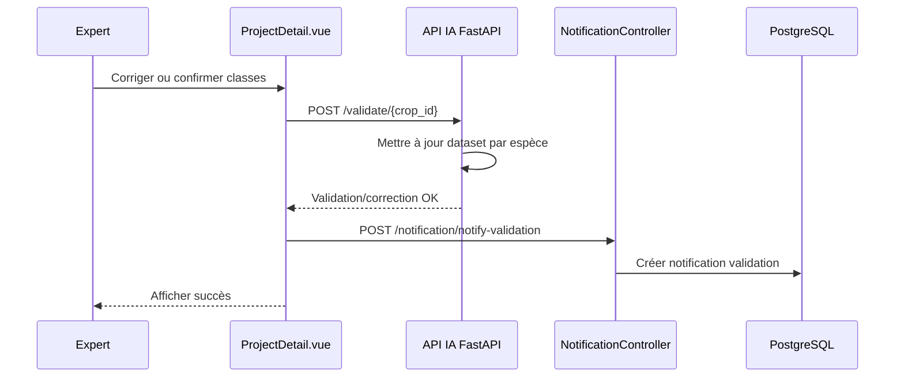

### CU13 - Consulter les analytics

| Champ | Description |
|---|---|
| ID | CU13 |
| Cas d'utilisation | Consulter les analytics |
| Description | Affiche statistiques par espèce, pourcentage Karenia, historique et dataset IA. |
| Acteurs primaires | Utilisateur autorisé, Expert, Administrateur |
| Préconditions | Projet consultable. |
| Enchaînement principal | 1. L'acteur ouvre l'onglet Analytics. 2. Le frontend calcule les métriques des annotations. 3. Il récupère les statistiques dataset et historique si nécessaire. 4. Les graphiques sont affichés. |
| Postconditions | L'acteur visualise l'état du projet et les risques bloom. |

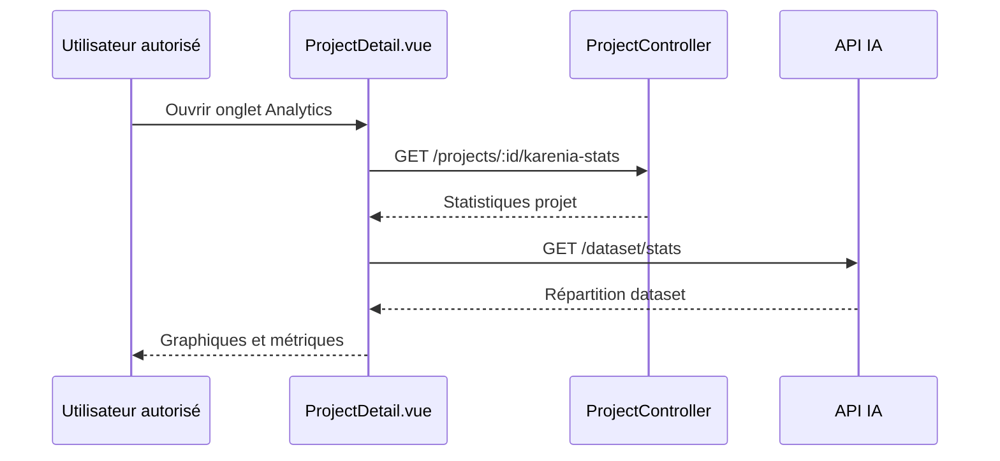

### CU14 - Recevoir une alerte bloom

| Champ | Description |
|---|---|
| ID | CU14 |
| Cas d'utilisation | Recevoir une alerte bloom |
| Description | Déclenche une notification quand le pourcentage de Karenia dépasse le seuil configuré. |
| Acteurs primaires | Expert, Administrateur |
| Préconditions | Analyse IA terminée avec cellules détectées. |
| Enchaînement principal | 1. Le frontend calcule le pourcentage Karenia. 2. Si le seuil est atteint, il appelle `notify-bloom-alert`. 3. Le backend déduplique les alertes récentes. 4. Les admins/experts reçoivent une notification. |
| Postconditions | Une alerte non lue est disponible. |

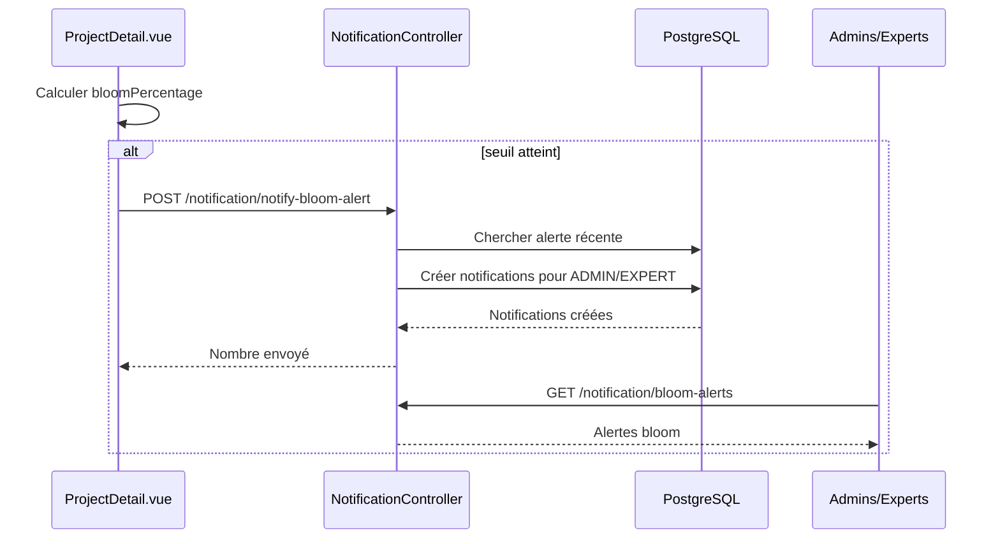

### CU15 - Gérer les notifications

| Champ | Description |
|---|---|
| ID | CU15 |
| Cas d'utilisation | Gérer les notifications |
| Description | Lire, marquer comme lue, tout marquer comme lu ou supprimer les notifications. |
| Acteurs primaires | Utilisateur authentifié |
| Préconditions | Utilisateur connecté. |
| Enchaînement principal | 1. L'utilisateur ouvre le menu notifications. 2. Le backend renvoie ses notifications. 3. L'utilisateur marque une ou toutes les notifications comme lues. |
| Postconditions | L'état `isRead` ou `deletedAt` est mis à jour. |

```mermaid
sequenceDiagram
participant U as Utilisateur
participant UI as NotificationsMenu
participant API as NotificationController
participant DB as PostgreSQL
U->>UI: Ouvrir notifications
UI->>API: GET /notification/me
API->>DB: Chercher notifications utilisateur
DB-->>API: Liste
API-->>UI: Notifications
U->>UI: Marquer comme lue
UI->>API: PATCH /notification/:id/read
API->>DB: isRead = true
DB-->>API: OK
API-->>UI: Mise à jour
```

### CU16 - Gérer les modèles IA

| Champ | Description |
|---|---|
| ID | CU16 |
| Cas d'utilisation | Gérer les modèles IA |
| Description | Créer, consulter, modifier, supprimer ou importer les modèles IA référencés par les annotations. |
| Acteurs primaires | Administrateur, Expert |
| Préconditions | Acteur authentifié avec accès au module AiModel. |
| Enchaînement principal | 1. L'acteur ouvre la gestion des modèles. 2. Il réalise une opération CRUD/import. 3. Le backend met à jour `AiModel`. |
| Postconditions | Les modèles IA disponibles sont à jour. |

```mermaid
sequenceDiagram
participant U as Admin/Expert
participant UI as AiModel views
participant API as AiModelController
participant DB as PostgreSQL
U->>UI: Ouvrir modèles IA
UI->>API: GET /aimodels
API->>DB: Charger modèles
DB-->>API: Liste
API-->>UI: Données
U->>UI: Créer/modifier/supprimer
UI->>API: POST/PATCH/DELETE /aimodels
API->>DB: Mettre à jour AiModel
DB-->>API: OK
API-->>UI: Résultat
```

### CU17 - Gérer les annotations manuelles

| Champ | Description |
|---|---|
| ID | CU17 |
| Cas d'utilisation | Gérer les annotations |
| Description | Permet de consulter, créer, modifier, supprimer ou importer des annotations. |
| Acteurs primaires | Expert, Administrateur, Technicien selon droits |
| Préconditions | Image et modèle IA existants. |
| Enchaînement principal | 1. L'acteur ouvre le module annotations. 2. Il renseigne image, modèle et résultat. 3. Le backend persiste l'annotation. |
| Postconditions | L'annotation est liée à une image et à un modèle IA. |

```mermaid
sequenceDiagram
participant U as Acteur métier
participant UI as Annotation views
participant API as AnnotationController
participant DB as PostgreSQL
U->>UI: Créer ou modifier annotation
UI->>API: POST/PATCH /annotations
API->>DB: Vérifier Image et AiModel
API->>DB: Créer/mettre à jour Annotation
DB-->>API: Annotation
API-->>UI: Résultat
UI-->>U: Confirmation
```

### CU18 - Gérer les collaborateurs

| Champ | Description |
|---|---|
| ID | CU18 |
| Cas d'utilisation | Gérer les collaborateurs |
| Description | Associe des utilisateurs à des projets via l'entité `Collaborator`. |
| Acteurs primaires | Administrateur, Expert, Technicien selon droits |
| Préconditions | Projet et utilisateur existants. |
| Enchaînement principal | 1. L'acteur ouvre le module collaborateurs. 2. Il sélectionne un utilisateur et un projet. 3. Le backend crée ou modifie l'association. |
| Postconditions | Le collaborateur est associé au projet. |

```mermaid
sequenceDiagram
participant U as Acteur autorisé
participant UI as Collaborator views
participant API as CollaboratorController
participant DB as PostgreSQL
U->>UI: Sélectionner projet + utilisateur
UI->>API: POST /collaborators
API->>DB: Créer Collaborator
DB-->>API: Association créée
API-->>UI: Résultat
UI-->>U: Liste mise à jour
```

### CU19 - Gérer les configurations

| Champ | Description |
|---|---|
| ID | CU19 |
| Cas d'utilisation | Gérer les configurations |
| Description | Gère les paramètres applicatifs stockés sous forme clé/valeur. |
| Acteurs primaires | Administrateur |
| Préconditions | Administrateur authentifié. |
| Enchaînement principal | 1. L'admin ouvre les configurations. 2. Il crée ou modifie une clé. 3. Le backend enregistre `AppConfig`. |
| Postconditions | La configuration applicative est mise à jour. |

```mermaid
sequenceDiagram
participant A as Administrateur
participant UI as AppConfig views
participant API as AppConfigController
participant DB as PostgreSQL
A->>UI: Modifier configuration
UI->>API: POST/PATCH /appconfigs
API->>DB: Upsert AppConfig(key,value)
DB-->>API: Configuration sauvegardée
API-->>UI: Résultat
UI-->>A: Confirmation
```

### CU20 - Réentraîner le modèle IA

| Champ | Description |
|---|---|
| ID | CU20 |
| Cas d'utilisation | Réentraîner le modèle IA |
| Description | Lance un réentraînement simulé lorsque le dataset contient assez d'images validées. |
| Acteurs primaires | Expert, Administrateur |
| Préconditions | Dataset IA disponible, nombre minimal d'images atteint. |
| Enchaînement principal | 1. L'acteur clique sur Améliorer modèle. 2. Le frontend appelle `POST /retrain`. 3. L'API IA vérifie le nombre d'images. 4. Le réentraînement est lancé en tâche de fond. |
| Postconditions | Le processus de réentraînement est démarré. |

```mermaid
sequenceDiagram
participant E as Expert/Admin
participant UI as ProjectDetail.vue
participant AI as API IA FastAPI
E->>UI: Cliquer Améliorer modèle
UI->>AI: GET /dataset/stats
AI-->>UI: Total dataset
alt total suffisant
UI->>AI: POST /retrain
AI->>AI: Lancer tâche de fond
AI-->>UI: status=started
UI-->>E: Message de lancement
else total insuffisant
AI-->>UI: Erreur minimum requis
UI-->>E: Afficher erreur
end
```

## 7. Diagrammes de séquence transversaux

### 7.1 Séquence complète d'analyse IA avec alerte bloom

```mermaid
sequenceDiagram
participant User as Technicien/Expert
participant Vue as ProjectDetail.vue
participant AI as API IA
participant Notif as NotificationController
participant DB as PostgreSQL
User->>Vue: Sélectionner images
Vue->>AI: POST /predict_from_urls(selectedImages)
AI-->>Vue: Résultats par image + microalgues
Vue->>Vue: Calculer counts et pourcentages
alt Karenia >= seuil
Vue->>Notif: POST /notify-bloom-alert
Notif->>DB: Vérifier doublons 24h
Notif->>DB: Créer notifications ADMIN/EXPERT
end
Vue->>Notif: POST /notify-analysis
Notif->>DB: Créer notification utilisateur
Vue-->>User: Afficher résultats + analytics
```

### 7.2 Séquence complète de permission projet

```mermaid
sequenceDiagram
participant Admin as Administrateur
participant Vue as ProjectPermissions.vue
participant Ctrl as ProjectPermissionController
participant Serv as ProjectPermissionService
participant DB as PostgreSQL
Admin->>Vue: Choisir utilisateur et droits
Vue->>Ctrl: POST /project-permission/grant
Ctrl->>Serv: grantPermissions(data)
Serv->>DB: Vérifier projet
Serv->>DB: Vérifier utilisateur cible
Serv->>DB: Vérifier grantedBy est ADMIN
Serv->>DB: Upsert ProjectPermission
DB-->>Serv: Permission
Serv-->>Ctrl: Permission avec user/project
Ctrl-->>Vue: Succès
Vue-->>Admin: Affichage droits mis à jour
```

## 8. Exemple de table d'analyse

| Élément | Analyse |
|---|---|
| Besoin métier | Identifier les microalgues dans des images de projet et détecter les risques de bloom. |
| Acteurs clés | Administrateur, Expert, Technicien, Utilisateur. |
| Données principales | Projet, Image, Annotation, Modèle IA, Notification, Permission. |
| Règle importante | Un utilisateur non admin ne voit que ses projets ou les projets partagés via `ProjectPermission`. |
| Risque métier | Une mauvaise classification IA doit pouvoir être corrigée par un expert. |
| Réponse système | Les corrections alimentent le dataset IA par classe (`Karenia`, `Alexandrium`, `Autres`). |
| Sortie attendue | Résultats d'analyse, graphiques, alertes bloom, historique et notifications. |

## 9. Synthèse des modules

| Module | Fichiers principaux | Rôle |
|---|---|---|
| Authentification | `server/src/auth`, `client-ui/src/store/useAuth.ts` | Inscription, connexion, reset, activation/rejet. |
| Projets | `server/src/project`, `client-ui/src/views/main/project` | CRUD projet, galerie, analytics. |
| Permissions | `server/src/project-permission` | Droits par projet : view/upload/annotate/validate/edit/delete. |
| Images | `server/src/image`, `client-ui/src/views/main/image` | Gestion des images liées aux projets. |
| Annotations | `server/src/annotation` | Résultats IA ou annotations manuelles. |
| API IA | `ai-api/main.py` | Prédiction, validation de crop, dataset, réentraînement. |
| Notifications | `server/src/notification` | Notifications utilisateur, alertes bloom, lecture/suppression. |
| Configuration | `server/src/appConfig` | Paramètres clé/valeur. |
